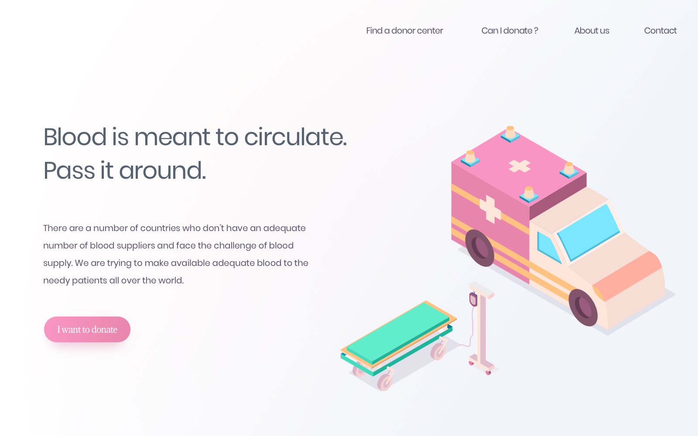

# Frontend Mentor - Blood Donation Landing Page Challenge

Welcome! Thanks for checking out this front-end coding challenge. 

Your task is to build out the project to the design inside the `/design` folder.

This project poses some nice challenges using CSS gradients. You'll need to place two gradients as a background on the `body` and figure out how to reduce the intensity of the colours.

**The challenge does not require any JavaScript and should not include any front-end frameworks/libraries**.

If you decide to push the project live, tweet **@frontendmentor** once you're finished with your URL in the tweet. I'd love to take a look at what you've built!

Feedback is always welcome, so if you have any regarding this challenge please email me at matt[at]frontendmentor[dot]io.

Have fun building!

## Styleguide

### Gradients
- Body background: `linear rgba(255,255,255,0.03) to rgba(184,201,229,1) at 165 degrees`
- Body background: `radial circle rgb(238,184,189) to rgb(255,255,255) at 75% from left and 75% from top`
- Call-to-action: `rgb(249,149,194) to rgb(232,133,173)`

### Shades
- Dark (for body copy): `rgb(86,98,112)` 

### Typography
#### Font Family
- [Poppins](https://fonts.google.com/specimen/Poppins)
- [Adamina](https://fonts.google.com/specimen/Adamina)

#### Font Weights
- 400